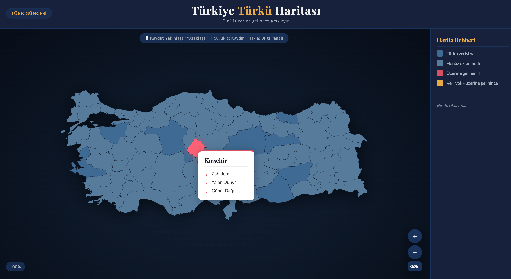

# Türkiye Türkü Haritası

An interactive map of Turkey's 81 provinces displaying regional folk songs (türküler). Built for [Türk Güncesi](https://blog.turkguncesi.com/).



## Features

- **Hover tooltips** — hover over any province to see its folk songs in a floating tooltip
- **Click to pin** — click a province to display its info persistently in the side panel
- **Zoom & pan** — mouse wheel to zoom (centred on cursor), click and drag to pan
- **Zoom controls** — `+`, `−`, and `Reset` buttons with a live scale badge
- **Search** — search across all türküler by title
- **Random türkü** — button picks a random song from the full database and shows its province
- **Extra regions** — dedicated buttons for songs from Rumeli, Kerkük, Azerbaycan, Kıbrıs, Musul, and Kırım
- **Diğer category** — songs whose `yoresi_ili` doesn't match a Turkish province are grouped here
- **Mobile drawer** — on small screens, the side panel slides in via a toggle button
- **Data-driven highlights** — provinces with song data are visually distinct from empty ones

## File Structure

```
index.html      # Main page — SVG map embedded inline
styles.css      # All styling and theme variables
app.js          # Interactivity: hover, tooltip, zoom, pan, search, data fetching
songs.jsonl     # Song database — one JSON object per line (JSONL format)
```

## Adding Songs

Append new lines to `songs.jsonl`. Each line is a self-contained JSON object:

```jsonl
{"song_title": "Karamana Giderim", "yoresi_ili": "KONYA", "repertuar_no": "1234", "ilcesi_koyu": "-", "kaynak_kisi": "...", "derleyen": "...", "notaya_alan": "...", "icra_eden": "-", "makamsal_dizi": "...", "konusu_turu": "Aşk Sevda", "karar_sesi": "Re", "bitis_sesi": "Re", "usul": "-", "en_pes_ses": "Re", "en_tiz_ses": "La", "ses_genisligi": "5 Ses", "lyrics": "Verse 1\nVerse 2", "source_url": "https://..."}
```

Songs are grouped by `yoresi_ili`. The field is matched case-insensitively and supports many ASCII/alternate spellings (e.g. `SANLIURFA` → Şanlıurfa, `AFYON` → Afyonkarahisar). Any entry whose `yoresi_ili` doesn't match one of Turkey's 81 provinces is automatically placed in the appropriate extra region (Rumeli, Kerkük, Azerbaycan, Kıbrıs, Musul, Kırım) or the catch-all **Diğer** category.

## Running Locally

Open `index.html` via a local server so `songs.jsonl` loads correctly:

```bash
npx serve .
# or
python3 -m http.server
```

> **Note:** There is no mock/fallback data. The map requires `songs.jsonl` to be served alongside `index.html`. Opening via `file://` won't work — use a local server.

## Tech Stack

- HTML5 / CSS3 / Vanilla JavaScript (ES6+)
- No external libraries or frameworks
- SVG map © [Simplemaps.com](https://simplemaps.com) (free for commercial use)